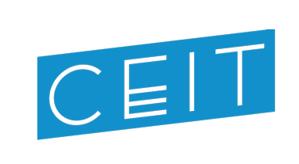

# CEIT


Package for Electric Impedance Tomography on detecting Capacitance Density

## Table of Contents
- [CEIT](#ceit)
  - [Table of Contents](#table-of-contents)
  - [Overview](#overview)
  - [Requirements](#requirements)
  - [Configure the calculation](#configure-the-calculation)
  - [Quick Start](#quick-start)
  - [Read Mesh Class](#read-mesh-class)
    - [1. Initialize a new mesh](#1-initialize-a-new-mesh)
    - [2. Read from generated mesh cache](#2-read-from-generated-mesh-cache)
  - [Forward Simulator](#forward-simulator)
  - [Jacobian Constructor](#jacobian-constructor)
  - [Realtime Solver](#realtime-solver)
  - [How to implement your own forward model?](#how-to-implement-your-own-forward-model)
  - [Cite our work](#cite-our-work)

## Overview

This package is designed for solving the tomographic problem concerned with detecting proximity map by a planar conductive sensor.

It can also be used on other "weird" types of EIT-like problem(different differential equation compared to traditional EIT), **this package is now focusing on Gauss-Newton solver**. If you are looking into impedance problem specifically, then maybe you want to check out this [package](https://github.com/liubenyuan/pyEIT).

For more information, please check my paper (Not online yet).

The `efem.py` module is written only for this problem, other modules can be reused in any other EIT application.

CEIT provides the ability to generate solver for realtime reconstruction.
Given the meshes and electrode positions, CEIT can generate Inverse model for any planar sensor design.

> **KIND REMINDER**: be sure to config the `.gitignore` file, the `.csv` files generated are pretty large...

## Requirements

See `requirements.txt`, one thing to mention is that to accelerate the calculation process, we used GPU acceleration for matrix multiplication.
So if you don't have a beefy GPU, then please set the device option in `config.json` to `"cpu"` and do the following things:

> 1. comment out content inside function `calculate_FEM_equation()` at the end of file `./MyEIT/efem.py`.
> 2. Add a line `pass` to the function.
> 3. comment out `import cupy as cp` in `./MyEIT/efem.py`.

```shell
python -m pip install -r requirements.txt
```
If you have a decent GPU, install [`cupy`](https://docs.cupy.dev/en/stable/install.html) package according to your CUDA version.
```shell
python -m pip install cupy-cuda101
```
**Currently this package only work on 2D meshes.**

## Configure the calculation

You should configure the `config.json` file before using this package.

A `.fem` file is needed for initializing the whole process. You can get one by using CAD software.

Also, you have to decide your electrode center positions, and your radius of the electrode.
Inside this package, the electrode is square shaped for which the radius means **half width** of the square.
Be sure to set all the fields.

For Examples see `config.json` file.

| Parameter Name | Type | Description |
| :----: | :----: |:----:|
|`"signal_frequency"`| `Number` | Frequency of your input signal unit: Hz |
|`"resistance"`|`Number`| The resistance of the coductive sheet unit: &Omega;/sq 
| `"mesh_filename"` | `String` | File name for your mesh file |
| `"folder_name"` | `String` | Specify the folder you push your mesh file and all the cache files.|
| `"optimize_node_num"`| `Boolean` | Whether shuffle node number at initializing mesh |
| `"shuffle_element"` | `Boolean` | Whether shuffle elemets at initializing mesh |
| `"electrode_centers"` | `Array` | Center of electrodes on perimeter THE UNIT IS **mm** |
| `"electrode_radius"`| `Number` | In this package electrodes are treated as square shaped, this parameter is half of its side length.
| `"capacitance_change_for_JAC"` |`Number`| Capacitance change on every single element when calculating the Jacobian matrix.|
| `"detection_bound"`| `Number` | Specify the detection boundary size please keep its unit identical to the `"unit"` property|
| `"calc_from"`| `Number` | Set starting electrode for Jacobian calculation, for multiple instances compute usage.
| `"calc_end"` | `Number` | Set ending electrode for Jacobian calculation, for multiple instances compute usage.
| `"regularization_coeff"` | `Number` | This parameter is used in regularization equation of reconstruction, **you will have to optimize it**.
| `"device"` |  `String` | Calculation device, only `"cpu"` or `"gpu"` is accepted, if you choose `"cpu"` please follow the instructions in the previous paragraph.|
| `"unit"` | `String` | Unit for the input above. Only `"mm"` or `"SI"` is accepted, **they will all be transferred into SI unit**.|
|`"mesh_unit"`| `String` |`"mm"`if mesh unit is in millimeter unit, if it's in SI unit, use any other string.
| `"reconstruction_mode"` |`String`| DEPRECATED ITEM keep this to `"n"`|
| `"overall_origin_capacitance"` |`Number`| DEPRECATED ITEM keep this to `0`|

## Quick Start

There are some samples in the folder.

* `Example_01` Initilize Mesh
* `Example_02` Forward Calculation
* `Example_03` Generate jacobian matrix
* `Example_04` Realtime solver


## Read Mesh Class

All the mesh initializer is put in `MyEIT.readmesh`.

Now the reader only work with `.fem` files generated by Altair HyperMesh

### 1. Initialize a new mesh
First you should finish configuring your `config.json` file according to the previous paragraph.

Then on the first time running of a new mesh, call `init_mesh()` function to initialize mesh.

When initializing, the class will automatically clear out duplicated mesh and you can decide whether it 
should shuffle the mesh number or not.

After initializing, in the folder you specified before, the method would generate a `Mesh_Cache_Node.csv` 
file and a `Mesh_Cache_Element.csv` file.

```python
from MyEIT.readmesh import init_mesh

init_mesh(draw=True)
```

### 2. Read from generated mesh cache

After initializing the mesh, you can quickly read from the cache file.

Class `read_mesh_from_csv` provides function to read mesh from csv file.
The default calculation unit inside CEIT is **SI** units, if your mesh is in **mm** unit, please set in `config.json` file.

**You need to call `return_mesh()` method to get the mesh object and electrode information.**

```python
from MyEIT.readmesh import read_mesh_from_csv

read_mesh = read_mesh_from_csv()
mesh_obj,_,_,_ = read_mesh.return_mesh()
```

## Forward Simulator

The forward calculator is used Finite Element Method to calculate potential distribution on the surface.

First instantiate the class after reading the mesh file.
```python
from MyEIT.efem import EFEM

fwd_model = EFEM(mesh_obj)
```

The initializer will automatically prepare the object for calculation, now you have a fully functioning forward solver.

There are several functions provided by this object you can call to change capacitance value and do calculation.

|function Name|Description|
|:----:|:----:|
|`EFEM.calculation(electrode_input)`|Forward calculation on given input electrode selection **You have to call this to do the calculation**|
|`EFEM.plot_potential_map(ax)`|Plot the current forward result, default is `0` before calling `calculation()`|
|`EFEM.plot_current_capacitance(ax)`|Plot the given input condition|
|`EFEM.change_capacitance_elementwise(element_list, capacitance_list)`|Change capacitance density on selected elements|
|`EFEM.change_capacitance_geometry(center, radius, value, shape)`|**Assign** capacitance density on elements inside a certain geometry (square or circle) to the given value|
|`EFEM.change_add_capa_geometry(center, radius, value, shape)`|**Add** the given capacitance density on elements inside a certain geometry|
|`EFEM.change_conductivity(element_list, resistance_list)`|Change conductivity on certain elements|
|`EFEM.reset_capacitance(overall_capa)`|Set capacitance density on all elements to `overall_capa`|

## Jacobian Constructor

The `EJAC` class provides the function of doing jacobian calculation.

First instantiate the class, this class doesn't require creating the `EFEM` class, it will initialize it internally.
However, you have to get the mesh and pass it into the initializer
```python
from MyEIT.ejac import EJAC

jac_calc = EJAC(mesh_obj)
jac_calc.JAC_calculation()
```

If you had set the value `"is_first_JAC_calculation"` inside `config.json` file to `true`, then, if you call method `EJAC.JAC_calculation()`, it will start calculating the jacobianmatrix starting from electrode `"calc_from"` to `"calc_end"`
This allows you to calculate the jacobian matrix on different machines and then combine them together.
After one iteration (an electrode input condition), the function saves JAC matrix to cache file `JAC_cache.npy`.

**If the calculation is completed make sure you change the `"is_first_JAC_calculation"` property to `false`, so it won't calculate unexpectedly.**

**This calculation takes a lot of time so please make sure everything's right before starting.**

This class also provide some methods for you to reconstruct actual EIT data.

|Function Name|Description|
|:----:|:----:|
|`EJAC.JAC_calculation()`| Calculate and return JAC Matrix, Auto Save to File on every iteration|
|`EJAC.eit_solve(self, detect_potential, lmbda)`| Solve inverse problems base on the initial amplitude output (with no object above) generated by simulation **This is for simulation**|
|`EJAC.eit_solve_4electrodes()`| Solving 4 electrode condition. There are also functions for 8 electrodes|
|`EJAC.eit_solve_delta_V()`| Reconstruct based on the given amplitude change **This is for testing, use solver for realtime calculation**|
|`EJAC.save_inv_matrix(lmbda)`| set up inverse matrix for realtime solver with regularization parameter `lmbda`|
|`EJAC.show_JAC()`| Visualize jacobian matrix with color map|
To do more with the package, Please read the comment inside `ejac.py`.

## Realtime Solver

The `Solver` class provides the function of realtime reconstructing data fed in to the `Solver.solve()` function.
`Solver` class only has one method `Solver.solve()`.

An example
```python
from MyEIT.solver import Solver

solver = Solver()
delta_v = np.random.rand(240)
solver.solve(delta_v)
```

If you generated another Jacobian matrix, you can call the function `reinitialize_solver()` contained in the `MyEIT.solver` module to refresh your `inv_mat.npy` file.

```python
from MyEIT.solver import reinitialize_solver

reinitialize_solver()
```

## How to implement your own forward model?

For typical 2D EIT problems, this package can handle all the requirements from interpreting `.fem` mesh file, assigning electrode position, generating JAC matrix to solving the problem with ease of use.

With different differential equation, the FEM model is almost the same, but the core simulation algorithm has to be edited.

Check the `FEM_Basic` class and overwrite the following four method (**or (I actually recommend)** you can specify your own differential equation solver from scratch since the interpolation parameter has been provided in `self.elem_param` variable).

```python
self.construct_sparse_matrix()
self.set_boundary_condition(electrode_input)
self.calculate_FEM(theta)
self.sync_back_potential()
```

## Cite our work

This package is used in our paper presented on IECON 2020 conference, if you find this package helpful, please cite our work and give it a star or even better, commit a pull request.